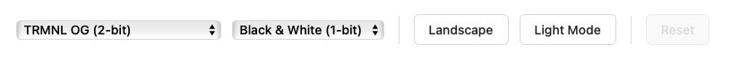

# @trmnl/picker

A lightweight JavaScript library for managing TRMNL device model and palette selection.

It's used by the core TRMNL web app, [trmnlp](https://github.com/usetrmnl/trmnlp), [BYOS (Bring Your Own Server)](https://docs.usetrmnl.com/go/diy/byos) applications, and anybody else who needs it.



## Live Demo

Try the interactive demo at [https://usetrmnl.github.io/trmnl-picker/example/](https://usetrmnl.github.io/trmnl-picker/example/)

## API Reference

See the [API documentation](https://usetrmnl.github.io/trmnl-picker/doc/) for complete information.

## Installation

### NPM
```bash
npm install @trmnl/picker
```

### Browser (CDN)
```html
<script src="https://unpkg.com/@trmnl/picker@latest/dist/trmnl-picker.min.js"></script>
```

### Browser (Local)
```html
<script src="dist/trmnl-picker.min.js"></script>
```

## Quick Start

### 1. Create HTML Structure

The library expects a form with specific data-* attributes. Apply your favorite CSS styling framework as desired.

```html
<form id="picker-form">
  <!-- Required: Model selector -->
  <select data-model-select></select>

  <!-- Required: Palette selector -->
  <select data-palette-select></select>

  <!-- Optional: Orientation toggle -->
  <button type="button" data-orientation-toggle>
    <span data-orientation-text>Landscape</span>
  </button>

  <!-- Optional: Dark mode toggle -->
  <button type="button" data-dark-mode-toggle>
    <span data-dark-mode-text>Light Mode</span>
  </button>

  <!-- Optional: Reset button -->
  <button type="button" data-reset-button>Reset</button>
</form>

<!-- The screen element to be modified -->
<div class="screen">
  <div class="view view--full">
    <!-- Your screen's content goes here -->
  </div>
</div>
```

### 2. Initialize Picker

```javascript
const picker = await TRMNLPicker.create('picker-form', {
  localStorageKey: 'my-trmnl-picker-state' // optional: persist user selection in localStorage
})
```

### 3. Listen for Changes

```javascript
document.getElementById('picker-form').addEventListener('trmnl:change', (event) => {
  const { origin, screenClasses, model, palette, isDarkMode, isPortrait } = event.detail

  document.querySelectorAll('.screen').forEach(screen => {
    screen.className = screenClasses.join(' ')
    executeTerminalize() // from Framework plugin.js
  })
})
```

## Development

```bash
# Install dependencies
npm install

# Build all formats
npm run build

# Build and watch for changes
npm run watch

# Build specific formats
npm run build:esm        # ES module
npm run build:browser    # IIFE browser bundle
npm run build:browser:min # Minified browser bundle

# Build docs
npm run build:docs
```

## Contributing

Contributions are welcome! Please open an issue or submit a pull request.

## Support

For issues and questions, please use the [GitHub issue tracker](https://github.com/usetrmnl/trmnl-picker/issues).
